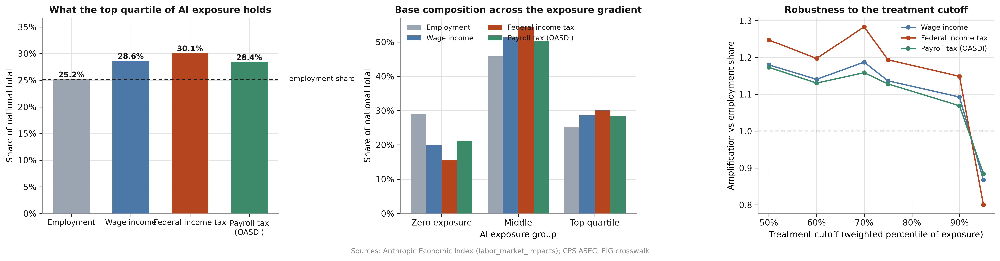

# Employment exposure is not fiscal exposure

**AI exposure is measured in workers. Governments are funded in dollars. This measures the gap between the two.**



## Why this matters

The question begins with where governments actually get their money. In the United States, individual income and payroll taxes together account for roughly eighty-five percent of federal receipts. The modern state is, effectively, a claim on wages. So any technology that changes which wages exist, and whose, is a fiscal question before it is anything else.

There is now a serious public debate about what to do if AI displaces a large amount of work: universal basic income, universal basic services, sovereign wealth funds giving citizens a stake in the models. Every one of those proposals assumes a state that can still raise revenue. Almost nobody has checked that assumption.

The existing measures cannot check it, because they are all employment-weighted. They tell you what share of *workers* sit in exposed occupations. Revenue is not distributed like headcount. A progressive income tax concentrates collection at the top of the earnings distribution, and AI exposure is concentrated there too. If both are true, the tax base is more exposed than the workforce, by an amount nobody has put a number on.

That number is what this repository produces.

## Two taxes, and why they diverge

The result turns on a structural difference between the two taxes funding the American state, so it is worth stating plainly.

**Federal income tax** is progressive. Rates rise through brackets as income rises, up to 37%. Someone earning four times the median pays considerably more than four times the tax.

**Payroll tax** is levied separately on wages and funds specific programmes rather than the general budget. Its larger component, **OASDI** (Old Age, Survivors, and Disability Insurance, which is Social Security), is charged at 6.2% on the employee side, but **only up to a ceiling**: $176,100 in 2025. Above that, the marginal rate is zero.

Two workers make the consequence concrete:

| Wage | OASDI owed | Income tax |
|---|---|---|
| $80,000 | $4,960, being 6.2% of all of it | rises with income |
| $400,000 | $10,918, being 6.2% of the first $176,100, then nothing | keeps rising |

The second earns five times the first but contributes barely twice as much to Social Security. Income tax has no such ceiling.

So the two taxes draw on different parts of the wage distribution. Income tax is sensitive to the top; OASDI is deliberately blind to it. If AI exposure concentrates at the top of the wage distribution, displacement in exposed occupations should threaten general revenue more than it threatens the trust funds. That is testable, and testing it is the point.

## What I did

I joined Anthropic's published occupation-level AI exposure data to CPS household microdata, then computed each exposure group's share of employment, wages, federal income tax and OASDI liability, and compared them.

- **Exposure:** the *observed exposure* measure of Massenkoff and McCrory (2026), from the Anthropic Economic Index. It is the share of an occupation's time-weighted tasks that are both theoretically feasible for a language model and actually observed in work-related Claude usage, with automated use weighted above augmentative use.
- **Population and earnings:** CPS ASEC 2024 and 2025 via IPUMS, restricted to employed people with positive wage income.
- **The join:** the AEI publishes on 6-digit SOC 2018 codes, the CPS uses Census occupation codes, so the two are linked through the Census Bureau's 2018 occupation code list.
- **Tax:** statutory brackets and the OASDI taxable maximum applied to wage income. Deliberately simple, and a known limitation discussed below.

Workers are sorted by their occupation's exposure score and cut into groups holding equal shares of *employment*, not equal numbers of occupation codes. About 29% of workers sit in occupations scoring exactly zero, too large a block of tied scores to split cleanly into quartiles, so the analysis compares three groups: **zero exposure**, **middle**, and **top quartile**.

## Results

CPS ASEC 2024 and 2025. Exposure attached to 94.4% of weighted employment.

**Share of each national base**

| | Zero exposure | Middle | Top quartile |
|---|---|---|---|
| Employment | 29.0% | 45.9% | 25.2% |
| Wage income | 20.0% | 51.4% | 28.6% |
| Federal income tax | 15.6% | 54.3% | 30.1% |
| Payroll tax (OASDI) | 21.2% | 50.4% | 28.4% |

Read the first column as: workers in occupations with no measured AI exposure are 29% of the workforce, earn 20% of all wages, and pay 15.6% of all federal income tax.

**Amplification**, each base share divided by the same group's employment share. Above 1 means a group carries more of that base than its headcount implies; below 1, less.

| | Zero exposure | Middle | Top quartile |
|---|---|---|---|
| Wage income | 0.69 | 1.12 | 1.14 |
| Federal income tax | **0.54** | **1.18** | **1.19** |
| Payroll tax (OASDI) | 0.73 | 1.10 | 1.13 |

Three findings follow.

### 1. The tax base is considerably more exposed than the workforce

71% of American workers are in occupations with any measured AI exposure. They pay **84%** of all federal income tax.

Per worker, someone in a top-quartile exposed occupation pays **2.2 times** the federal income tax of someone in an unexposed one, on a wage only **1.65 times** larger. Progressivity roughly doubles the fiscal footprint of the earnings gap. This is the core result: counting workers systematically understates how much of the revenue base is in the line of fire.

### 2. It is a threshold, not a gradient

This is the part I did not expect. Income tax amplification runs 0.54, then 1.18, then 1.19. Almost all the movement happens at the boundary between zero exposure and any exposure at all (+0.65). Across the whole remaining range, from moderately exposed to most exposed, it moves by +0.01.

Knowing *whether* an occupation has AI-touchable tasks tells you nearly everything about its fiscal weight. Knowing *how many* tells you almost nothing further.

That has a practical implication. Nearly all work with these measures ranks occupations continuously and studies the top quintile. For fiscal purposes that is the wrong cut. An early-warning indicator built on this data should track the size of the zero-exposure group, not the intensity of exposure at the top.

### 3. Exposed and unexposed work are financed through different taxes

For every dollar of income-tax base they generate, zero-exposure workers supply **1.36** dollars of OASDI base. Exposed workers supply **0.95**.

Unexposed employment is relatively payroll-financed; exposed employment relatively income-tax-financed. Displacement concentrated in exposed occupations therefore lands on general revenue, while Social Security and Medicare lean comparatively on the unexposed workforce.

That inverts the industrial-robot era, when displacement fell in the middle of the wage distribution. It matters for the policy question, because it says which programme comes under strain first, and general revenue and the trust funds are governed by entirely different political constraints.

The direct top-quartile test of this is weaker than the mechanism alone predicts: income tax amplification 1.19 against OASDI 1.13, a gap of only +0.07. The reason is a data limitation, and it is worth being precise about it.

## What this is and is not

A static accounting of the composition of **today's** tax base. It measures how much of the base sits in the line of fire. It does not forecast, and it does not estimate displacement.

- Exposure is measured from **Claude usage**, not all AI usage.
- **Exposure is not displacement.** Anthropic find no systematic unemployment increase among exposed workers so far.
- The theoretical-capability layer is pinned to early-2023 model capability.
- There is **no behavioural response, no reallocation, no general equilibrium**. In reality displaced workers move to other occupations, and that is precisely the mechanism which rescued the tax base during robot adoption. Whether it recurs is the open question. Nothing here settles it.
- Tax is levied on households, not persons. Two-earner couples split across exposure groups are approximated.

### Why the payroll result is understated

Two limitations push the same way, and both bite hardest exactly where the mechanism lives.

**CPS top-codes wage income.** The taxable maximum sits near the top 6% of earners, so OASDI compression is an upper-tail phenomenon. That tail is precisely what top-coding flattens. The estimate is conservative by construction.

**The tax function is crude.** Liability comes from statutory brackets on wage income for a single filer, with no dependants, credits, or non-wage income. It preserves progressivity, which is all the amplification result depends on, but it misstates levels and cannot capture how filing status and capital income redistribute liability at the top.

Neither casts doubt on the direction. Both are arguments for better data, which is the next step rather than an excuse.

### Checks that passed

- The zero-exposure group is **28.9%** of weighted employment, against roughly 30% in Anthropic's own work. This is the strongest validation available: their group boundary reconstructed from public data through an independent crosswalk, landing within a percentage point.
- The crosswalk covers **93.9%** of CPS occupation codes and **94.4%** of weighted employment.
- The implied wage gap between top-quartile and zero-exposure workers is **+65%**, against roughly +47% reported by Anthropic. Larger, same direction. The likely cause is that this analysis restricts to employed people with positive wage income, a narrower universe than theirs.

### One join caveat

Where a Census occupation category spans several SOC occupations, exposure is averaged **equally** across them. Weighting by BLS OES employment would be better. The configuration hook exists (`crosswalk.weight_col`) and is currently unused.

## What this opens onto

The Budget Lab at Yale's AI tax microsimulation names exactly one missing input: "the missing piece is an occupation-level exposure imputation onto the tax-unit file", absent because the IRS Public Use File carries no occupation. The CPS does carry occupation, which is why this pilot starts there, at the cost of the top-tail accuracy discussed above.

Four things follow directly:

- **TAXSIM** for real federal liability, using household variables already in the extract.
- **A statistical match of occupation onto the IRS PUF**, removing the top-coding problem and filling the Budget Lab's stated gap.
- **Employment-weighted crosswalk aggregation** using BLS OES.
- **Extension across OECD tax mixes.** The same exposure shock has very different fiscal consequences depending on whether a country finances social protection through payroll contributions or through consumption taxes. This also bounds the sovereign wealth fund proposals, which are only available to countries that host the firms.

## Running it

```bash
git clone https://github.com/morvanzmt/ai-fiscal-exposure
cd ai-fiscal-exposure
uv venv && source .venv/bin/activate
uv pip install -e ".[dev,notebook,fetch]"

# End to end on synthetic fixtures. No downloads, no credentials.
python scripts/01_fetch.py --synthetic
python scripts/02_build_dataset.py --config config/config.synthetic.yaml
pytest
```

For the real run, with retrieval instructions in [`data/README.md`](data/README.md):

```bash
export IPUMS_API_KEY="..."
python scripts/01b_ipums_extract.py --submit --wait --download
python scripts/01_fetch.py --aei
python scripts/01c_build_crosswalk.py
cp config/config.real.yaml config/config.yaml
python scripts/02_build_dataset.py --config config/config.yaml
```

A narrative walkthrough is in [`notebooks/walkthrough.ipynb`](notebooks/walkthrough.ipynb).

## Reproducibility

Every pipeline step appends to `output/manifest.json`: the files read and written with SHA-256 digests, the parameters in force, the git revision, and diagnostics such as crosswalk coverage. Any figure traces back to the exact inputs that produced it. Paths, column names and analysis parameters live in `config/`, never in code.

Several of the 29 tests exist because they catch errors that eyeballing a figure never would:

- Tied exposure scores must not be split across bins. 29% of workers sit at exactly zero, and a naive quantile cut would divide them arbitrarily. The binning code warns when this happens, which is why the headline uses the zero-versus-top contrast rather than raw quartiles.
- OASDI liability must flatten above the taxable maximum. That is the entire mechanism behind the payroll result.
- IPUMS sentinel values (`99999999` for not-in-universe) must be cleared before any arithmetic, or they enter weighted totals as hundred-million-dollar salaries.
- Census occupation codes must keep their leading zeros, or `0010` becomes `10` and silently fails to merge.

## Method note on the crosswalk

Two details in the SOC-to-Census join are easy to get wrong, and both fail quietly rather than loudly.

The Census list frequently maps one Census code to a SOC **broad group** (`11-9030`) while exposure is published at the **detailed** level (`11-9031`). Since a trailing zero marks a group rather than an occupation, these must be expanded hierarchically. Without it, roughly a third of exposure codes silently fail to match, and the ones that go missing are not random: they are disproportionately the large white-collar categories this analysis is about.

The Census workbook also contains a 2010-to-2018 sheet that merges perfectly well while being on the wrong vintage. Sheets are therefore ranked by name rather than chosen on volume of matches.

## Sources

Massenkoff and McCrory (2026), *Labor market impacts of AI: A new measure and early evidence* · Anthropic Economic Index, `labor_market_impacts` release (CC-BY) · CPS ASEC via IPUMS · US Census Bureau, 2018 Census Occupation Code List · Korinek and Lockwood (2025), *Preserving Fiscal Stability in the Age of Transformative AI* · Hötte et al. (2024), *Oxford Economic Papers* · Acemoglu and Restrepo (2020), *JPE* · Eloundou et al. (2023) · The Budget Lab at Yale (2026) · Windfall Trust, *Mapping Tax Risks From Labour-Displacing AI* · ITIF (2026). Links in [`data/README.md`](data/README.md).

## Licence

MIT for the code. Input data remains under its original licence; the Anthropic Economic Index is CC-BY.
